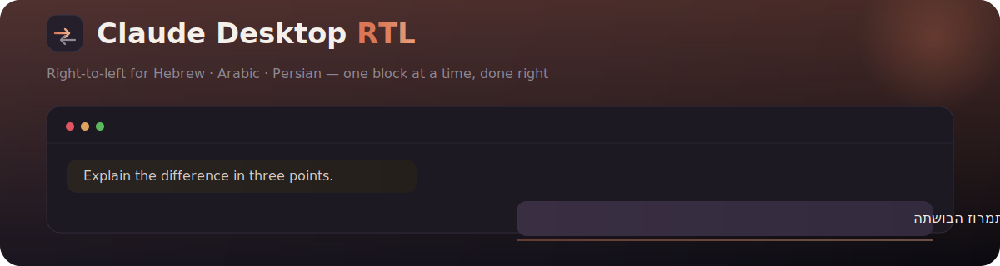

<div align="center">



<br/>

[](https://github.com/eliranpv11/claude-desktop-rtl/actions/workflows/ci.yml)
[](https://github.com/eliranpv11/claude-desktop-rtl/releases)
[](LICENSE)
[](#-installation)

**Smooth right-to-left (Hebrew · Arabic · Persian) for Claude Desktop on Windows — and for claude.ai in any browser — powered by one pure, unit-tested engine.**

[English](README.md) · [**עברית**](README.he.md)

</div>

---

## The problem

Claude writes beautiful Hebrew — and then renders it **left-to-right**. Bullets land on the wrong side, punctuation jumps across the line, tables flow backwards, and `3 < 5` reads as `5 > 3`. Every naive fix flips the whole page and breaks your English and your code instead.

**Claude Desktop RTL fixes it the right way — one block at a time — without ever touching your text or your network.**

| Without the patch | With the patch |
| --- | --- |
| Hebrew paragraphs pinned to the left | Each Hebrew block flips right, English blocks stay left |
| List bullets & quote bars on the wrong side | Markers, indent and quote bars move to the correct side |
| `3 < 5` visually reversed to `5 > 3` | Math and comparisons stay readable |
| Tables flow the wrong way | Column order and per-column alignment fixed |
| Arrows `→` point the wrong way | Flipped **visually** — the character is never changed |

---

## ✨ Why it's different

- 🎯 **Per-block direction, done right.** Every paragraph, list, table and quote decides its *own* direction from its *own* content. English and Hebrew coexist correctly **in the same message** — no global flip, the bug every naive tool ships.
- 🔒 **Zero network. Zero telemetry.** Nothing ever leaves your machine. Copy and Ctrl-F stay **byte-for-byte**: no invisible Unicode marks are injected, and arrows/operators are flipped *visually* while the underlying characters are untouched.
- 🛡️ **Safe by construction.** Originals are backed up with a validated, atomic copy **before** anything changes, and **any failure triggers an automatic rollback**. One command restores everything.
- 🧪 **A pure, tested core.** All bidi intelligence lives in a DOM-free engine with a torture-test corpus, decoupled from how it's delivered — and the CSS/DOM layer is verified in a real browser.
- 🧱 **Resilient to Claude updates.** The layer targets prose *tags*, not Claude's class names, so a Claude redesign doesn't silently break it.

---

## 🚀 Installation

### 🪟 Windows — Claude Desktop

Open **PowerShell** and run one line. For a single, self-contained window, start PowerShell with **“Run as administrator”** first:

```powershell
irm https://raw.githubusercontent.com/eliranpv11/claude-desktop-rtl/main/install.ps1 | iex
```

It downloads this repository, then opens an interactive menu — choose **1** to install. That's it: Claude relaunches with a green “RTL enabled” confirmation.

<details>
<summary>Prefer to run from a local clone?</summary>

```powershell
git clone https://github.com/eliranpv11/claude-desktop-rtl.git
cd claude-desktop-rtl
powershell -ExecutionPolicy Bypass -File .\windows\patch.ps1 -Preflight   # read-only readiness check
powershell -ExecutionPolicy Bypass -File .\windows\patch.ps1              # interactive menu
```
</details>

**Requirements:** Windows 10/11, [Node.js](https://nodejs.org/) in `PATH` (used for `@electron/asar` + `@electron/fuses` via `npx`), and administrator rights for a Microsoft-Store (MSIX) install.

**Flags:** `-Install` · `-Restore` · `-Status` · `-Verify` · `-Preflight` · `-Watch` · `-Unwatch` · `-CleanCerts`

> ⚠️ **Windows only** for the desktop app. 🍎 **macOS:** try [toboly's](https://github.com/toboly/claude-desktop-rtl-patch-mac) or [soguy's](https://github.com/soguy/claude-desktop-rtl-mac) mac patches *(not tested here; use at your own risk)*.

### 🌐 Browser — claude.ai (any OS)

1. Install **Tampermonkey** (or Violentmonkey).
2. Open the latest [**`claude-rtl.user.js`**](https://github.com/eliranpv11/claude-desktop-rtl/releases/latest) release asset and install it.
3. Reload `claude.ai` — Hebrew/Arabic replies read right-to-left immediately, Artifacts panel included.

---

## 🧠 How it works (in 30 seconds)

Your browser already ships a complete Unicode Bidirectional Algorithm. This tool doesn't reimplement it — it makes the **direction & isolation decisions** and lets the renderer do the reordering:

- **CSS does ~85%.** `unicode-bidi: plaintext` on each prose leaf lets every block self-determine its base direction from its own first strong character. English stays LTR, Hebrew flips RTL — no container is ever force-flipped.
- **JS does only what CSS can't:** isolate math so `3 < 5` never reverses, flip arrows visually, mirror list/quote decoration to the correct side, and handle streaming without flicker — all while never mutating your text.
- **On the desktop**, the same engine is injected into Claude's renderer bundle; the Electron ASAR-integrity fuse is turned off so the modified bundle loads, and where `cowork-svc` guards `claude.exe` the binaries are re-signed with a local certificate. See **[SECURITY.md](SECURITY.md)** for the full trust model.

---

## 🗂️ Architecture

```
engine/     Pure, DOM-free bidi decision engine (unit-tested, no browser needed)
  ranges    Unicode script classification (astral-safe, 40+ RTL blocks)
  numbers   EN/AN digits, signed-run detection ("-5" vs Hebrew prefix "ל-15")
  detect    first-strong + majority; fallback is ALWAYS null, never forced RTL
  math      LaTeX vs currency ($5.99 stays text, $\frac{}{}$ is math)
  arrows    horizontal arrows needing a visual RTL flip (math/LTR-context aware)
  relations mirrored relations ("3 < 5" isolated so it never reads backwards)
  code      real code vs Hebrew prose mis-fenced as code
dom/        The thin runtime that applies the engine's decisions to Claude's UI
  apply.css declarative core (unicode-bidi:plaintext per leaf block)
  surfaces  single source of truth for Claude's selectors
  apply.js  streaming-settle observer, input guards, tables, structural flip
build/      Bundles engine+DOM+CSS into one self-contained IIFE (dist/payload.js)
windows/    The Windows patcher
  inject.mjs byte-exact injector (spares the main entry, keeps native modules)
  patch.ps1  install / restore / status / verify / watch — MSIX + Squirrel
dev/        Real-browser fixture for verifying the DOM/CSS layer
```

---

## ✅ Verify & uninstall

```powershell
.\windows\patch.ps1 -Status     # install model · patched? · backup present? · watcher?
.\windows\patch.ps1 -Verify     # asar payload marker + certificate check (read-only)
.\windows\patch.ps1 -Restore    # put the validated backups back, remove the local cert
```

In the console (browser or desktop devtools), `__claudeRtlDiag()` returns the payload `version`, the `booted` flag, and counts of `processed` and `rtlBlocks`.

---

## ⚖️ Limitations

- **Real code blocks stay LTR** by design (RTL scrambles braces/indentation). A fence that is actually Hebrew *prose* is detected and rendered RTL.
- **Desktop Artifacts** render in a cross-origin iframe the desktop payload can't enter yet — the **browser userscript** does cover them.
- Fuse-off needs Node (for `npx @electron/fuses`) at install time.

---

## 🛠️ Development

```bash
npm test        # engine + build unit tests (node:test, no browser needed)
npm run build   # regenerate dist/payload.js and dist/claude-rtl.user.js
node dev/fixture/serve.js   # real-browser fixture at http://localhost:5599/
```

See **[CONTRIBUTING.md](CONTRIBUTING.md)** for the workflow, **[CHANGELOG.md](CHANGELOG.md)** for release history, and **[SECURITY.md](SECURITY.md)** for the security model.

---

## 📄 License

[MIT](LICENSE) © [eliranpv11](https://github.com/eliranpv11)
